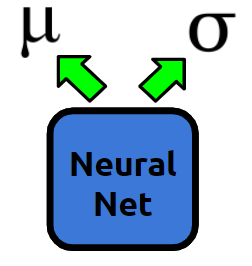

# RL_QAOA
Optimizing the performance of the Quantum Approximate Optimizaton Algorithm (QAOA) using Policy Gradients. 

The QAOA is a variational quantum algorithm for approximating the ground state of some Hamiltonian, H. The quality of the approximation obtained from the QAOA depends on several input parameters, \gamma and \beta . In this project, I used reinforcement learning in order to find optimial values of \gamma and \beta much faster than what was obtained by using classical optimization techniques alone. The model guesses the distribution from which to select \[ \gamma ]\ and \beta, as seen in .

